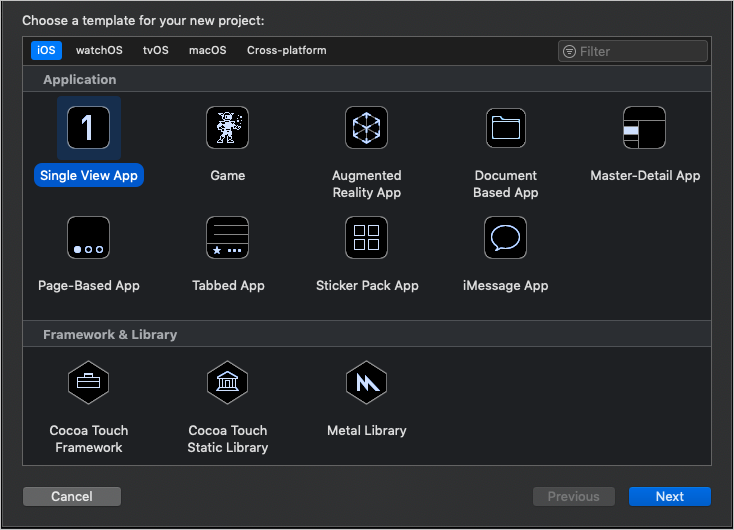
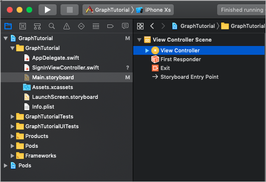
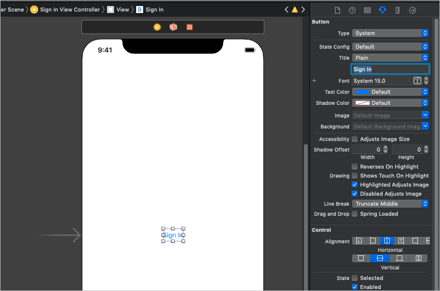
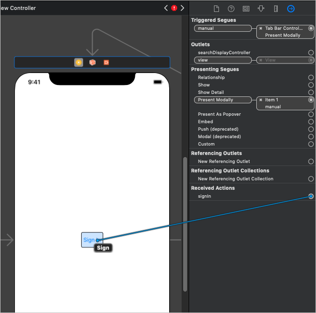
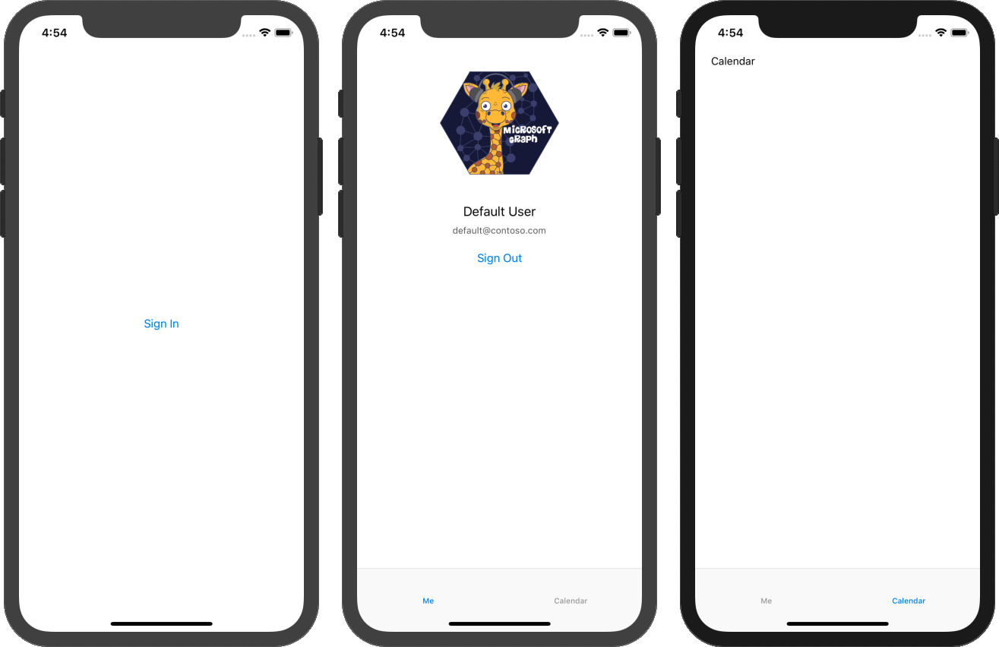

<!-- markdownlint-disable MD002 MD041 -->

<span data-ttu-id="c04d7-101">Para empezar, cree un nuevo proyecto SWIFT.</span><span class="sxs-lookup"><span data-stu-id="c04d7-101">Begin by creating a new Swift project.</span></span>

1. <span data-ttu-id="c04d7-102">Abra Xcode.</span><span class="sxs-lookup"><span data-stu-id="c04d7-102">Open Xcode.</span></span> <span data-ttu-id="c04d7-103">En el menú **archivo** , seleccione **nuevo**y, a continuación, **proyecto**.</span><span class="sxs-lookup"><span data-stu-id="c04d7-103">On the **File** menu, select **New**, then **Project**.</span></span>
1. <span data-ttu-id="c04d7-104">Elija la plantilla **aplicación de vista única** y seleccione **siguiente**.</span><span class="sxs-lookup"><span data-stu-id="c04d7-104">Choose the **Single View App** template and select **Next**.</span></span>

    

1. <span data-ttu-id="c04d7-106">Establezca el **nombre** del producto `GraphTutorial` en y el **idioma** en **SWIFT**.</span><span class="sxs-lookup"><span data-stu-id="c04d7-106">Set the **Product Name** to `GraphTutorial` and the **Language** to **Swift**.</span></span>
1. <span data-ttu-id="c04d7-107">Rellene los campos restantes y seleccione **siguiente**.</span><span class="sxs-lookup"><span data-stu-id="c04d7-107">Fill in the remaining fields and select **Next**.</span></span>
1. <span data-ttu-id="c04d7-108">Elija una ubicación para el proyecto y seleccione **crear**.</span><span class="sxs-lookup"><span data-stu-id="c04d7-108">Choose a location for the project and select **Create**.</span></span>

## <a name="install-dependencies"></a><span data-ttu-id="c04d7-109">Instalar dependencias</span><span class="sxs-lookup"><span data-stu-id="c04d7-109">Install dependencies</span></span>

<span data-ttu-id="c04d7-110">Antes de continuar, instale algunas dependencias adicionales que usará más adelante.</span><span class="sxs-lookup"><span data-stu-id="c04d7-110">Before moving on, install some additional dependencies that you will use later.</span></span>

- <span data-ttu-id="c04d7-111">[Biblioteca de autenticación de Microsoft (MSAL) para iOS](https://github.com/AzureAD/microsoft-authentication-library-for-objc) para la autenticación con Azure ad.</span><span class="sxs-lookup"><span data-stu-id="c04d7-111">[Microsoft Authentication Library (MSAL) for iOS](https://github.com/AzureAD/microsoft-authentication-library-for-objc) for authenticating to with Azure AD.</span></span>
- <span data-ttu-id="c04d7-112">[SDK de Microsoft Graph para Objective C](https://github.com/microsoftgraph/msgraph-sdk-objc) para realizar llamadas a Microsoft Graph.</span><span class="sxs-lookup"><span data-stu-id="c04d7-112">[Microsoft Graph SDK for Objective C](https://github.com/microsoftgraph/msgraph-sdk-objc) for making calls to Microsoft Graph.</span></span>
- <span data-ttu-id="c04d7-113">El [SDK de modelos de Microsoft Graph para Objective C](https://github.com/microsoftgraph/msgraph-sdk-objc-models) para objetos con establecimiento inflexible de tipos que representan recursos de Microsoft Graph, como usuarios o eventos.</span><span class="sxs-lookup"><span data-stu-id="c04d7-113">[Microsoft Graph Models SDK for Objective C](https://github.com/microsoftgraph/msgraph-sdk-objc-models) for strongly-typed objects representing Microsoft Graph resources like users or events.</span></span>

1. <span data-ttu-id="c04d7-114">Salga de Xcode.</span><span class="sxs-lookup"><span data-stu-id="c04d7-114">Quit Xcode.</span></span>
1. <span data-ttu-id="c04d7-115">Abra terminal y cambie el directorio a la ubicación del proyecto de **GraphTutorial** .</span><span class="sxs-lookup"><span data-stu-id="c04d7-115">Open Terminal and change the directory to the location of your **GraphTutorial** project.</span></span>
1. <span data-ttu-id="c04d7-116">Ejecute el siguiente comando para crear un Podfile.</span><span class="sxs-lookup"><span data-stu-id="c04d7-116">Run the following command to create a Podfile.</span></span>

    ```Shell
    pod init
    ```

1. <span data-ttu-id="c04d7-117">Abra Podfile y agregue las siguientes líneas justo después de la `use_frameworks!` línea.</span><span class="sxs-lookup"><span data-stu-id="c04d7-117">Open the Podfile and add the following lines just after the `use_frameworks!` line.</span></span>

    ```Ruby
    pod 'MSAL', '~> 1.0.2'
    pod 'MSGraphClientSDK', ' ~> 1.0.0'
    pod 'MSGraphClientModels', '~> 1.3.0'
    ```

1. <span data-ttu-id="c04d7-118">Guarde la Podfile y, a continuación, ejecute el siguiente comando para instalar las dependencias.</span><span class="sxs-lookup"><span data-stu-id="c04d7-118">Save the Podfile, then run the following command to install the dependencies.</span></span>

    ```Shell
    pod install
    ```

1. <span data-ttu-id="c04d7-119">Una vez que se complete el comando, abra el **GraphTutorial. xcworkspace** recién creado en Xcode.</span><span class="sxs-lookup"><span data-stu-id="c04d7-119">Once the command completes, open the newly created **GraphTutorial.xcworkspace** in Xcode.</span></span>

## <a name="design-the-app"></a><span data-ttu-id="c04d7-120">Diseñar la aplicación</span><span class="sxs-lookup"><span data-stu-id="c04d7-120">Design the app</span></span>

<span data-ttu-id="c04d7-121">En esta sección, creará las vistas de la aplicación: una página de inicio de sesión, un explorador de barras de pestañas, una página de bienvenida y una página de calendario.</span><span class="sxs-lookup"><span data-stu-id="c04d7-121">In this section you will create the views for the app: a sign in page, a tab bar navigator, a welcome page, and a calendar page.</span></span> <span data-ttu-id="c04d7-122">También creará una superposición del indicador de actividad.</span><span class="sxs-lookup"><span data-stu-id="c04d7-122">You'll also create an activity indicator overlay.</span></span>

### <a name="create-sign-in-page"></a><span data-ttu-id="c04d7-123">Página de creación de inicio de sesión</span><span class="sxs-lookup"><span data-stu-id="c04d7-123">Create sign in page</span></span>

1. <span data-ttu-id="c04d7-124">Expanda la carpeta **GraphTutorial** en Xcode y, a continuación, seleccione **ViewController. SWIFT**.</span><span class="sxs-lookup"><span data-stu-id="c04d7-124">Expand the **GraphTutorial** folder in Xcode, then select **ViewController.swift**.</span></span>
1. <span data-ttu-id="c04d7-125">En el **Inspector de archivos**, cambie el **nombre** del archivo a `SignInViewController.swift`.</span><span class="sxs-lookup"><span data-stu-id="c04d7-125">In the **File Inspector**, change the **Name** of the file to `SignInViewController.swift`.</span></span>

    

1. <span data-ttu-id="c04d7-127">Abra **SignInViewController. SWIFT** y reemplace su contenido por el código siguiente.</span><span class="sxs-lookup"><span data-stu-id="c04d7-127">Open **SignInViewController.swift** and replace its contents with the following code.</span></span>

    ```Swift
    import UIKit

    class SignInViewController: UIViewController {

        override func viewDidLoad() {
            super.viewDidLoad()
            // Do any additional setup after loading the view.
        }

        @IBAction func signIn() {
            self.performSegue(withIdentifier: "userSignedIn", sender: nil)
        }
    }
    ```

1. <span data-ttu-id="c04d7-128">Abra el archivo **Main. Storyboard** .</span><span class="sxs-lookup"><span data-stu-id="c04d7-128">Open the **Main.storyboard** file.</span></span>
1. <span data-ttu-id="c04d7-129">Expanda **View Controller Scene**y, a continuación, seleccione **View Controller**.</span><span class="sxs-lookup"><span data-stu-id="c04d7-129">Expand **View Controller Scene**, then select **View Controller**.</span></span>

    

1. <span data-ttu-id="c04d7-131">Seleccione el **Inspector de identidad**y, a continuación, cambie el desplegable de **clase** a **SignInViewController**.</span><span class="sxs-lookup"><span data-stu-id="c04d7-131">Select the **Identity Inspector**, then change the **Class** dropdown to **SignInViewController**.</span></span>

    

1. <span data-ttu-id="c04d7-133">Seleccione la **biblioteca**y, a continuación, arrastre un **botón** hasta el **controlador de vista de inicio de sesión**.</span><span class="sxs-lookup"><span data-stu-id="c04d7-133">Select the **Library**, then drag a **Button** onto the **Sign In View Controller**.</span></span>

    

1. <span data-ttu-id="c04d7-135">Con el botón seleccionado, seleccione el **Inspector de atributos** y cambie el **título** del botón a `Sign In`.</span><span class="sxs-lookup"><span data-stu-id="c04d7-135">With the button selected, select the **Attributes Inspector** and change the **Title** of the button to `Sign In`.</span></span>

    

1. <span data-ttu-id="c04d7-137">Seleccione el **controlador de vista de inicio de sesión**y, a continuación, seleccione el **Inspector de conexiones**.</span><span class="sxs-lookup"><span data-stu-id="c04d7-137">Select the **Sign In View Controller**, then select the **Connections Inspector**.</span></span>
1. <span data-ttu-id="c04d7-138">En **acciones recibidas**, arrastre el círculo no rellenado junto a **iniciar sesión** en el botón.</span><span class="sxs-lookup"><span data-stu-id="c04d7-138">Under **Received Actions**, drag the unfilled circle next to **signIn** onto the button.</span></span> <span data-ttu-id="c04d7-139">Seleccione **retocar dentro** del menú emergente.</span><span class="sxs-lookup"><span data-stu-id="c04d7-139">Select **Touch Up Inside** on the pop-up menu.</span></span>

    

1. <span data-ttu-id="c04d7-141">En el menú **Editor** , seleccione **resolver problemas de diseño automático**y, a continuación, seleccione **Agregar restricciones que faltan** debajo **de todas las vistas en el controlador de vista de inicio de sesión**.</span><span class="sxs-lookup"><span data-stu-id="c04d7-141">On the **Editor** menu, select **Resolve Auto Layout Issues**, then select **Add Missing Constraints** underneath **All Views in Sign In View Controller**.</span></span>

### <a name="create-tab-bar"></a><span data-ttu-id="c04d7-142">Crear barra de pestañas</span><span class="sxs-lookup"><span data-stu-id="c04d7-142">Create tab bar</span></span>

1. <span data-ttu-id="c04d7-143">Seleccione la **biblioteca**y, a continuación, arrastre un **controlador de barra de pestañas** hasta el guión gráfico.</span><span class="sxs-lookup"><span data-stu-id="c04d7-143">Select the **Library**, then drag a **Tab Bar Controller** onto the storyboard.</span></span>
1. <span data-ttu-id="c04d7-144">Seleccione el **controlador de vista de inicio de sesión**y, a continuación, seleccione el **Inspector de conexiones**.</span><span class="sxs-lookup"><span data-stu-id="c04d7-144">Select the **Sign In View Controller**, then select the **Connections Inspector**.</span></span>
1. <span data-ttu-id="c04d7-145">En **segues desencadenados**, arrastre el círculo no rellenado junto a **manual** en el controlador de la **barra de pestañas** del guión gráfico.</span><span class="sxs-lookup"><span data-stu-id="c04d7-145">Under **Triggered Segues**, drag the unfilled circle next to **manual** onto the **Tab Bar Controller** on the storyboard.</span></span> <span data-ttu-id="c04d7-146">Seleccione **presente** de forma modal en el menú emergente.</span><span class="sxs-lookup"><span data-stu-id="c04d7-146">Select **Present Modally** in the pop-up menu.</span></span>

    

1. <span data-ttu-id="c04d7-148">Seleccione el segue que acaba de agregar y, a continuación, seleccione el **Inspector de atributos**.</span><span class="sxs-lookup"><span data-stu-id="c04d7-148">Select the segue you just added, then select the **Attributes Inspector**.</span></span> <span data-ttu-id="c04d7-149">Establezca el campo **identificador** en `userSignedIn`y establezca **presentación** en **pantalla completa**.</span><span class="sxs-lookup"><span data-stu-id="c04d7-149">Set the **Identifier** field to `userSignedIn`, and set **Presentation** to **Full Screen**.</span></span>

    

1. <span data-ttu-id="c04d7-151">Seleccione la **escena elemento 1**y, a continuación, seleccione el **Inspector de conexiones**.</span><span class="sxs-lookup"><span data-stu-id="c04d7-151">Select the **Item 1 Scene**, then select the **Connections Inspector**.</span></span>
1. <span data-ttu-id="c04d7-152">En **segues desencadenados**, arrastre el círculo no rellenado junto a **manual** en el **controlador de vista de inicio de sesión** del guión gráfico.</span><span class="sxs-lookup"><span data-stu-id="c04d7-152">Under **Triggered Segues**, drag the unfilled circle next to **manual** onto the **Sign In View Controller** on the storyboard.</span></span> <span data-ttu-id="c04d7-153">Seleccione **presente** de forma modal en el menú emergente.</span><span class="sxs-lookup"><span data-stu-id="c04d7-153">Select **Present Modally** in the pop-up menu.</span></span>
1. <span data-ttu-id="c04d7-154">Seleccione el segue que acaba de agregar y, a continuación, seleccione el **Inspector de atributos**.</span><span class="sxs-lookup"><span data-stu-id="c04d7-154">Select the segue you just added, then select the **Attributes Inspector**.</span></span> <span data-ttu-id="c04d7-155">Establezca el campo **identificador** en `userSignedOut`y establezca **presentación** en **pantalla completa**.</span><span class="sxs-lookup"><span data-stu-id="c04d7-155">Set the **Identifier** field to `userSignedOut`, and set **Presentation** to **Full Screen**.</span></span>

### <a name="create-welcome-page"></a><span data-ttu-id="c04d7-156">Crear Página principal</span><span class="sxs-lookup"><span data-stu-id="c04d7-156">Create welcome page</span></span>

1. <span data-ttu-id="c04d7-157">Seleccione el archivo **assets. xcassets** .</span><span class="sxs-lookup"><span data-stu-id="c04d7-157">Select the **Assets.xcassets** file.</span></span>
1. <span data-ttu-id="c04d7-158">En el menú **Editor** , seleccione **Agregar activos**y, a continuación, **nuevo conjunto de imágenes**.</span><span class="sxs-lookup"><span data-stu-id="c04d7-158">On the **Editor** menu, select **Add Assets**, then **New Image Set**.</span></span>
1. <span data-ttu-id="c04d7-159">Seleccione el nuevo recurso de **imagen** y use el **Inspector de atributos** para establecer su `DefaultUserPhoto` **nombre** en.</span><span class="sxs-lookup"><span data-stu-id="c04d7-159">Select the new **Image** asset and use the **Attribute Inspector** to set its **Name** to `DefaultUserPhoto`.</span></span>
1. <span data-ttu-id="c04d7-160">Agregue cualquier imagen que quiera que sirva como una foto de Perfil de usuario predeterminada.</span><span class="sxs-lookup"><span data-stu-id="c04d7-160">Add any image you like to serve as a default user profile photo.</span></span>

    

1. <span data-ttu-id="c04d7-162">Cree un nuevo archivo de **clase táctil de cacao** en la carpeta `WelcomeViewController` **GraphTutorial** denominada.</span><span class="sxs-lookup"><span data-stu-id="c04d7-162">Create a new **Cocoa Touch Class** file in the **GraphTutorial** folder named `WelcomeViewController`.</span></span> <span data-ttu-id="c04d7-163">Elija **UIViewController** en el campo **subclase de** .</span><span class="sxs-lookup"><span data-stu-id="c04d7-163">Choose **UIViewController** in the **Subclass of** field.</span></span>
1. <span data-ttu-id="c04d7-164">Abra **WelcomeViewController. SWIFT** y reemplace su contenido por el código siguiente.</span><span class="sxs-lookup"><span data-stu-id="c04d7-164">Open **WelcomeViewController.swift** and replace its contents with the following code.</span></span>

    ```Swift
    import UIKit

    class WelcomeViewController: UIViewController {

        @IBOutlet var userProfilePhoto: UIImageView!
        @IBOutlet var userDisplayName: UILabel!
        @IBOutlet var userEmail: UILabel!

        override func viewDidLoad() {
            super.viewDidLoad()

            // Do any additional setup after loading the view.

            // TEMPORARY
            self.userProfilePhoto.image = UIImage(imageLiteralResourceName: "DefaultUserPhoto")
            self.userDisplayName.text = "Default User"
            self.userEmail.text = "default@contoso.com"
        }

        @IBAction func signOut() {
            self.performSegue(withIdentifier: "userSignedOut", sender: nil)
        }
    }
    ```

1. <span data-ttu-id="c04d7-165">Abra **Main. Storyboard**.</span><span class="sxs-lookup"><span data-stu-id="c04d7-165">Open **Main.storyboard**.</span></span> <span data-ttu-id="c04d7-166">Seleccione la **escena elemento 1**y, a continuación, seleccione el **Inspector de identidad**.</span><span class="sxs-lookup"><span data-stu-id="c04d7-166">Select the **Item 1 Scene**, then select the **Identity Inspector**.</span></span> <span data-ttu-id="c04d7-167">Cambie el valor de la **clase** a **WelcomeViewController**.</span><span class="sxs-lookup"><span data-stu-id="c04d7-167">Change the **Class** value to **WelcomeViewController**.</span></span>
1. <span data-ttu-id="c04d7-168">Mediante el uso de la **biblioteca**, agregue los siguientes elementos a la **escena elemento 1**.</span><span class="sxs-lookup"><span data-stu-id="c04d7-168">Using the **Library**, add the following items to the **Item 1 Scene**.</span></span>

    - <span data-ttu-id="c04d7-169">Una **vista de imagen**</span><span class="sxs-lookup"><span data-stu-id="c04d7-169">One **Image View**</span></span>
    - <span data-ttu-id="c04d7-170">Dos **etiquetas**</span><span class="sxs-lookup"><span data-stu-id="c04d7-170">Two **Labels**</span></span>
    - <span data-ttu-id="c04d7-171">Un **botón**</span><span class="sxs-lookup"><span data-stu-id="c04d7-171">One **Button**</span></span>

1. <span data-ttu-id="c04d7-172">Seleccione la vista de imagen y, a continuación, seleccione el **Inspector de tamaño**.</span><span class="sxs-lookup"><span data-stu-id="c04d7-172">Select the image view, then select the **Size Inspector**.</span></span>
1. <span data-ttu-id="c04d7-173">Establezca el **ancho** y el **alto** en 196.</span><span class="sxs-lookup"><span data-stu-id="c04d7-173">Set the **Width** and **Height** to 196.</span></span>
1. <span data-ttu-id="c04d7-174">Seleccione la segunda etiqueta y, a continuación, seleccione el **Inspector de atributos**.</span><span class="sxs-lookup"><span data-stu-id="c04d7-174">Select the second label, then select the **Attributes Inspector**.</span></span>
1. <span data-ttu-id="c04d7-175">Cambie el **color** a **color gris oscuro**y cambie la **fuente** a **sistema 12,0**.</span><span class="sxs-lookup"><span data-stu-id="c04d7-175">Change the **Color** to **Dark Gray Color**, and change the **Font** to **System 12.0**.</span></span>
1. <span data-ttu-id="c04d7-176">Seleccione el botón y, a continuación, seleccione el **Inspector de atributos**.</span><span class="sxs-lookup"><span data-stu-id="c04d7-176">Select the button, then select the **Attributes Inspector**.</span></span>
1. <span data-ttu-id="c04d7-177">Cambie el **título** a `Sign Out`.</span><span class="sxs-lookup"><span data-stu-id="c04d7-177">Change the **Title** to `Sign Out`.</span></span>
1. <span data-ttu-id="c04d7-178">Mediante el **Inspector de conexiones**, realice las siguientes conexiones.</span><span class="sxs-lookup"><span data-stu-id="c04d7-178">Using the **Connections Inspector**, make the following connections.</span></span>

    - <span data-ttu-id="c04d7-179">Vincule el tomacorriente **userDisplayName** a la primera etiqueta.</span><span class="sxs-lookup"><span data-stu-id="c04d7-179">Link the **userDisplayName** outlet to the first label.</span></span>
    - <span data-ttu-id="c04d7-180">Vincule la toma de **userEmail** a la segunda etiqueta.</span><span class="sxs-lookup"><span data-stu-id="c04d7-180">Link the **userEmail** outlet to the second label.</span></span>
    - <span data-ttu-id="c04d7-181">Vincule el tomacorriente **userProfilePhoto** a la vista de imagen.</span><span class="sxs-lookup"><span data-stu-id="c04d7-181">Link the **userProfilePhoto** outlet to the image view.</span></span>
    - <span data-ttu-id="c04d7-182">Vincular la acción de **signOut** recibido a la **pantalla táctil**del botón en.</span><span class="sxs-lookup"><span data-stu-id="c04d7-182">Link the **signOut** received action to the button's **Touch Up Inside**.</span></span>

1. <span data-ttu-id="c04d7-183">Seleccione el elemento de la barra de pestañas en la parte inferior de la escena y, a continuación, seleccione el **Inspector de atributos**.</span><span class="sxs-lookup"><span data-stu-id="c04d7-183">Select the tab bar item at the bottom of the scene, then select the **Attributes Inspector**.</span></span> <span data-ttu-id="c04d7-184">Cambie el **título** a `Me`.</span><span class="sxs-lookup"><span data-stu-id="c04d7-184">Change the **Title** to `Me`.</span></span>
1. <span data-ttu-id="c04d7-185">En el menú **Editor** , seleccione **resolver problemas de diseño automático**y, a continuación, seleccione **Agregar restricciones que faltan** debajo **de todas las vistas en el controlador de vista de bienvenida**.</span><span class="sxs-lookup"><span data-stu-id="c04d7-185">On the **Editor** menu, select **Resolve Auto Layout Issues**, then select **Add Missing Constraints** underneath **All Views in Welcome View Controller**.</span></span>

<span data-ttu-id="c04d7-186">La escena de bienvenida debe tener una apariencia similar a la siguiente una vez que haya terminado.</span><span class="sxs-lookup"><span data-stu-id="c04d7-186">The welcome scene should look similar to this once you're done.</span></span>


### <a name="create-calendar-page"></a><span data-ttu-id="c04d7-188">Crear página de calendario</span><span class="sxs-lookup"><span data-stu-id="c04d7-188">Create calendar page</span></span>

1. <span data-ttu-id="c04d7-189">Cree un nuevo archivo de **clase táctil de cacao** en la carpeta `CalendarViewController` **GraphTutorial** denominada.</span><span class="sxs-lookup"><span data-stu-id="c04d7-189">Create a new **Cocoa Touch Class** file in the **GraphTutorial** folder named `CalendarViewController`.</span></span> <span data-ttu-id="c04d7-190">Elija **UIViewController** en el campo **subclase de** .</span><span class="sxs-lookup"><span data-stu-id="c04d7-190">Choose **UIViewController** in the **Subclass of** field.</span></span>
1. <span data-ttu-id="c04d7-191">Abra **CalendarViewController. SWIFT** y reemplace su contenido por el código siguiente.</span><span class="sxs-lookup"><span data-stu-id="c04d7-191">Open **CalendarViewController.swift** and replace its contents with the following code.</span></span>

    ```Swift
    import UIKit

    class CalendarViewController: UIViewController {

        @IBOutlet var calendarJSON: UITextView!

        override func viewDidLoad() {
            super.viewDidLoad()

            // Do any additional setup after loading the view.

            // TEMPORARY
            calendarJSON.text = "Calendar"
            calendarJSON.sizeToFit()
        }
    }
    ```

1. <span data-ttu-id="c04d7-192">Abra **Main. Storyboard**.</span><span class="sxs-lookup"><span data-stu-id="c04d7-192">Open **Main.storyboard**.</span></span> <span data-ttu-id="c04d7-193">Seleccione la **escena elemento 2**y, a continuación, seleccione el **Inspector de identidad**.</span><span class="sxs-lookup"><span data-stu-id="c04d7-193">Select the **Item 2 Scene**, then select the **Identity Inspector**.</span></span> <span data-ttu-id="c04d7-194">Cambie el valor de la **clase** a **CalendarViewController**.</span><span class="sxs-lookup"><span data-stu-id="c04d7-194">Change the **Class** value to **CalendarViewController**.</span></span>
1. <span data-ttu-id="c04d7-195">Con la **biblioteca**, agregue una **vista de texto** a la **escena del elemento 2**.</span><span class="sxs-lookup"><span data-stu-id="c04d7-195">Using the **Library**, add a **Text View** to the **Item 2 Scene**.</span></span>
1. <span data-ttu-id="c04d7-196">Seleccione la vista de texto que acaba de agregar.</span><span class="sxs-lookup"><span data-stu-id="c04d7-196">Select the text view you just added.</span></span> <span data-ttu-id="c04d7-197">En el **Editor**, elija **incrustar en**y, a continuación, **vista de desplazamiento**.</span><span class="sxs-lookup"><span data-stu-id="c04d7-197">On the **Editor**, choose **Embed In**, then **Scroll View**.</span></span>
1. <span data-ttu-id="c04d7-198">Mediante el **Inspector de conexiones**, conecte el tomacorriente **calendarJSON** a la vista de texto.</span><span class="sxs-lookup"><span data-stu-id="c04d7-198">Using the **Connections Inspector**, connect the **calendarJSON** outlet to the text view.</span></span>
1. 1. <span data-ttu-id="c04d7-199">Seleccione el elemento de la barra de pestañas en la parte inferior de la escena y, a continuación, seleccione el **Inspector de atributos**.</span><span class="sxs-lookup"><span data-stu-id="c04d7-199">Select the tab bar item at the bottom of the scene, then select the **Attributes Inspector**.</span></span> <span data-ttu-id="c04d7-200">Cambie el **título** a `Calendar`.</span><span class="sxs-lookup"><span data-stu-id="c04d7-200">Change the **Title** to `Calendar`.</span></span>
1. <span data-ttu-id="c04d7-201">En el menú **Editor** , seleccione **resolver problemas de diseño automático**y, a continuación, seleccione **Agregar restricciones que faltan** debajo **de todas las vistas en el controlador de vista de bienvenida**.</span><span class="sxs-lookup"><span data-stu-id="c04d7-201">On the **Editor** menu, select **Resolve Auto Layout Issues**, then select **Add Missing Constraints** underneath **All Views in Welcome View Controller**.</span></span>

<span data-ttu-id="c04d7-202">La escena del calendario debe tener un aspecto similar a este, una vez que haya terminado.</span><span class="sxs-lookup"><span data-stu-id="c04d7-202">The calendar scene should look similar to this once you're done.</span></span>


### <a name="create-activity-indicator"></a><span data-ttu-id="c04d7-204">Crear indicador de actividad</span><span class="sxs-lookup"><span data-stu-id="c04d7-204">Create activity indicator</span></span>

1. <span data-ttu-id="c04d7-205">Cree un nuevo archivo de **clase táctil de cacao** en la carpeta `SpinnerViewController` **GraphTutorial** denominada.</span><span class="sxs-lookup"><span data-stu-id="c04d7-205">Create a new **Cocoa Touch Class** file in the **GraphTutorial** folder named `SpinnerViewController`.</span></span> <span data-ttu-id="c04d7-206">Elija **UIViewController** en el campo **subclase de** .</span><span class="sxs-lookup"><span data-stu-id="c04d7-206">Choose **UIViewController** in the **Subclass of** field.</span></span>
1. <span data-ttu-id="c04d7-207">Abra **SpinnerViewController. SWIFT** y reemplace su contenido por el código siguiente.</span><span class="sxs-lookup"><span data-stu-id="c04d7-207">Open **SpinnerViewController.swift** and replace its contents with the following code.</span></span>

    ```Swift
    import UIKit

    class SpinnerViewController: UIViewController {

        var spinner = UIActivityIndicatorView(style: .whiteLarge)

        override func loadView() {
            view = UIView()
            view.backgroundColor = UIColor(white: 0, alpha: 0.7)

            spinner.translatesAutoresizingMaskIntoConstraints = false
            spinner.startAnimating()
            view.addSubview(spinner)

            spinner.centerXAnchor.constraint(equalTo: view.centerXAnchor).isActive = true
            spinner.centerYAnchor.constraint(equalTo: view.centerYAnchor).isActive = true
        }

        public func start(container: UIViewController) {
            container.addChild(self)
            self.view.frame = container.view.frame
            container.view.addSubview(self.view)
            self.didMove(toParent: container)
        }

        public func stop() {
            self.willMove(toParent: nil)
            self.view.removeFromSuperview()
            self.removeFromParent()
        }
    }
    ```

## <a name="test-the-app"></a><span data-ttu-id="c04d7-208">Probar la aplicación</span><span class="sxs-lookup"><span data-stu-id="c04d7-208">Test the app</span></span>

<span data-ttu-id="c04d7-209">Guarde los cambios e inicie la aplicación.</span><span class="sxs-lookup"><span data-stu-id="c04d7-209">Save your changes and launch the app.</span></span> <span data-ttu-id="c04d7-210">Debe poder moverse entre las pantallas con los botones **iniciar sesión** y **Cerrar sesión** y la barra de pestañas.</span><span class="sxs-lookup"><span data-stu-id="c04d7-210">You should be able to move between the screens using the **Sign In** and **Sign Out** buttons and the tab bar.</span></span>


