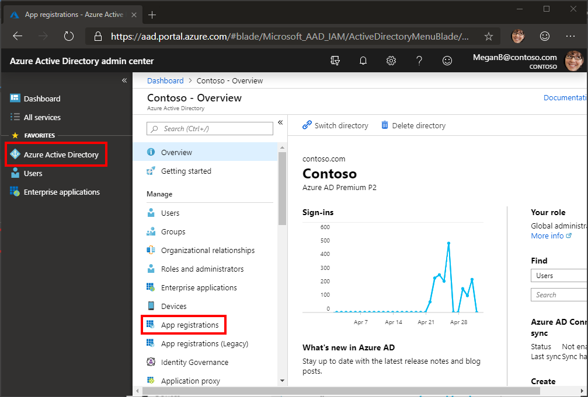
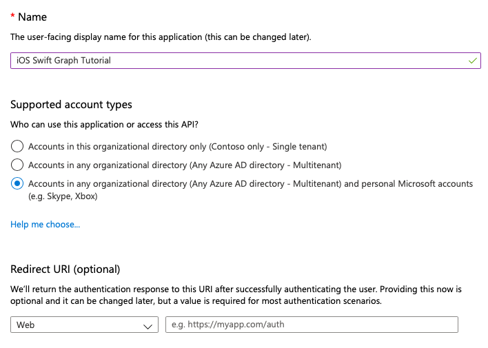

<!-- markdownlint-disable MD002 MD041 -->

En este ejercicio, creará una nueva aplicación nativa de Azure AD con el centro de administración de Azure Active Directory.In this exercise you will create a new Azure AD native application using the Azure Active Directory admin center.

1. Abra un explorador y vaya al [centro de administración de Azure Active Directory](https://aad.portal.azure.com) e inicie sesión con una **cuenta personal** (también conocida como: cuenta Microsoft) o una **cuenta profesional o educativa**.Open a browser and navigate to the [Azure Active Directory admin center](https://aad.portal.azure.com) and login using a **personal account** (aka: Microsoft Account) or **Work or School Account**.

1. Seleccione **Azure Active Directory** en el panel de navegación de la izquierda y, después, seleccione **registros de aplicaciones** en **administrar**.Select **Azure Active Directory** in the left-hand navigation, then select **App registrations** under **Manage**.

    

1. Seleccione **Nuevo registro**.Select **New registration**. En la página **Registrar una aplicación**, establezca los valores siguientes.On the **Register an application** page, set the values as follows.

    - Establezca **Nombre** como `iOS Swift Graph Tutorial`.Set **Name** to `iOS Swift Graph Tutorial`.
    - Establezca **Tipos de cuenta admitidos** en **Cuentas en cualquier directorio de organización y cuentas personales de Microsoft**.Set **Supported account types** to **Accounts in any organizational directory and personal Microsoft accounts**.
    - Deje **URI de redireccionamiento** vacía.Leave **Redirect URI** empty.

    

1. Seleccione **registrar**.Select **Register**. En la página **tutorial de iOS Graph para gráficos** , copie el valor del identificador de la **aplicación (cliente)** y guárdelo, lo necesitará en el paso siguiente.On the **iOS Swift Graph Tutorial** page, copy the value of the **Application (client) ID** and save it, you will need it in the next step.

    

1. Seleccione **Autenticación** en **Administrar**.Select **Authentication** under **Manage**. Seleccione **Agregar una plataforma**y, a continuación, **iOS/MacOS**.Select **Add a platform**, then **iOS / macOS**.

1. Escriba el identificador de paquete de la aplicación y seleccione **configurar**y, después, haga clic en **listo**.Enter your app's Bundle ID and select **Configure**, then select **Done**.
