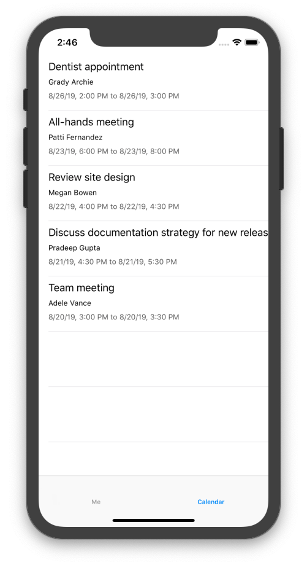

<!-- markdownlint-disable MD002 MD041 -->

En este ejercicio, incorporará Microsoft Graph a la aplicación. Para esta aplicación, usará el [SDK de Microsoft Graph para Objective C](https://github.com/microsoftgraph/msgraph-sdk-objc) para realizar llamadas a Microsoft Graph.

## <a name="get-calendar-events-from-outlook"></a>Obtener eventos de calendario de Outlook

En esta sección, ampliará la `GraphManager` clase para agregar una función para obtener los eventos del usuario y actualizar `CalendarViewController` para usar estas funciones nuevas.

1. Abra **GraphManager. SWIFT** y agregue el siguiente método a la `GraphManager` clase.

    ```Swift
    public func getEvents(completion: @escaping(Data?, Error?) -> Void) {
        // GET /me/events?$select='subject,organizer,start,end'$orderby=createdDateTime DESC
        // Only return these fields in results
        let select = "$select=subject,organizer,start,end"
        // Sort results by when they were created, newest first
        let orderBy = "$orderby=createdDateTime+DESC"
        let eventsRequest = NSMutableURLRequest(url: URL(string: "\(MSGraphBaseURL)/me/events?\(select)&\(orderBy)")!)
        let eventsDataTask = MSURLSessionDataTask(request: eventsRequest, client: self.client, completion: {
            (data: Data?, response: URLResponse?, graphError: Error?) in
            guard let eventsData = data, graphError == nil else {
                completion(nil, graphError)
                return
            }

            // TEMPORARY
            completion(eventsData, nil)
        })

        // Execute the request
        eventsDataTask?.execute()
    }
    ```

    > [!NOTE]
    > Tenga en cuenta lo que `getEvents` hace el código.
    >
    > - La dirección URL a la que se `/v1.0/me/events`llamará es.
    > - El `select` parámetro de consulta limita los campos devueltos para cada evento a solo aquellos que la aplicación usará realmente.
    > - El `orderby` parámetro de consulta ordena los resultados por la fecha y hora en que se crearon, con el elemento más reciente en primer lugar.

1. Abra **CalendarViewController. SWIFT** y reemplace todo su contenido por el código siguiente.

    ```Swift
    import UIKit
    import MSGraphClientModels

    class CalendarViewController: UIViewController {

        @IBOutlet var calendarJSON: UITextView!

        private let spinner = SpinnerViewController()

        override func viewDidLoad() {
            super.viewDidLoad()

            // Do any additional setup after loading the view.
            self.spinner.start(container: self)

            GraphManager.instance.getEvents {
                (data: Data?, error: Error?) in
                DispatchQueue.main.async {
                    self.spinner.stop()

                    guard let eventsData = data, error == nil else {
                        self.calendarJSON.text = error.debugDescription
                        return
                    }

                    let jsonString = String(data: eventsData, encoding: .utf8)
                    self.calendarJSON.text = jsonString
                    self.calendarJSON.sizeToFit()
                }
            }
        }
    }
    ```

Ahora puede ejecutar la aplicación, iniciar sesión y puntear en el elemento de navegación **calendario** del menú. Debería ver un volcado JSON de los eventos en la aplicación.

## <a name="display-the-results"></a>Mostrar los resultados

Ahora puede reemplazar el volcado de JSON con algo para mostrar los resultados de forma fácil de uso. En esta sección, modificará la `getEvents` función para que devuelva objetos con establecimiento inflexible de tipos `CalendarViewController` y lo modifique para usar una vista de tabla para representar los eventos.

1. Abra **GraphManager. SWIFT**. Reemplace la función `getEvents` existente por lo siguiente.

    :::code language="swift" source="../demo/GraphTutorial/GraphTutorial/GraphManager.swift" id="GetEventsSnippet" highlight="1,17-38":::

1. Cree un nuevo archivo de **clase táctil de cacao** en el proyecto `CalendarTableViewCell.swift` **GraphTutorial** denominado. Elija **UITableViewCell** en el campo **subclase de** .

1. Abra **CalendarTableViewCell. SWIFT** y agregue el código siguiente a la `CalendarTableViewCell` clase.

    :::code language="swift" source="../demo/GraphTutorial/GraphTutorial/CalendarTableViewCell.swift" id="PropertiesSnippet":::

1. Abra **Main. Storyboard** y busque la **escena del calendario**. Seleccione la **vista** de la **escena del calendario** y elimínela.

    

1. Agregue una **vista de tabla** de la **biblioteca** a la **escena del calendario**.
1. Seleccione la vista de tabla y, a continuación, seleccione el **Inspector de atributos**. Establezca **las celdas del prototipo** en **1**.
1. Use la **biblioteca** para agregar tres **etiquetas** a la celda del prototipo.
1. Seleccione la celda prototype y, a continuación, seleccione el **Inspector de identidad**. Cambie la **clase** a **CalendarTableViewCell**.
1. Seleccione el **Inspector de atributos** y establezca **identificador** en `EventCell`.
1. Con la **EventCell** seleccionada, seleccione el **Inspector de conexiones** y `durationLabel`Conéctese `organizerLabel`, `subjectLabel` y a las etiquetas que haya agregado a la celda en el guión gráfico.
1. Establezca las propiedades y restricciones de las tres etiquetas como se indica a continuación.

    - **Etiqueta de asunto**
        - Agregar restricción: espacio inicial para la vista de contenido margen inicial, valor: 0
        - Agregar restricción: espacio final para la vista de contenido margen final, valor: 0
        - Agregar restricción: espacio superior para la vista de contenido margen superior, valor: 0
    - **Etiqueta del organizador**
        - Fuente: sistema 12,0
        - Agregar restricción: espacio inicial para la vista de contenido margen inicial, valor: 0
        - Agregar restricción: espacio final para la vista de contenido margen final, valor: 0
        - Agregar restricción: espacio superior a etiqueta de asunto en la parte inferior, valor: estándar
    - **Etiqueta de duración**
        - Fuente: sistema 12,0
        - Color: color gris oscuro
        - Agregar restricción: espacio inicial para la vista de contenido margen inicial, valor: 0
        - Agregar restricción: espacio final para la vista de contenido margen final, valor: 0
        - Agregar restricción: espacio superior para etiqueta de Organizer en la parte inferior, valor: estándar
        - Agregar restricción: espacio inferior para la vista de contenido margen inferior, valor: 8

    

1. Abra **CalendarViewController. SWIFT** y reemplace su contenido por el código siguiente.

    :::code language="swift" source="../demo/GraphTutorial/GraphTutorial/CalendarViewController.swift" id="CalendarViewSnippet":::

1. Ejecute la aplicación, inicie sesión y pulse la pestaña **calendario** . Debe ver la lista de eventos.

    
